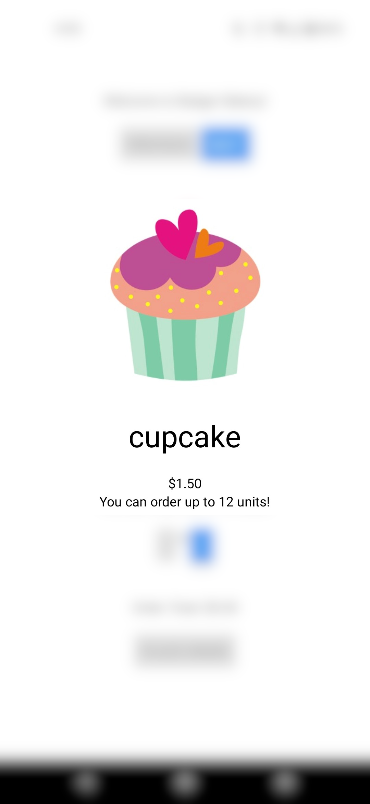
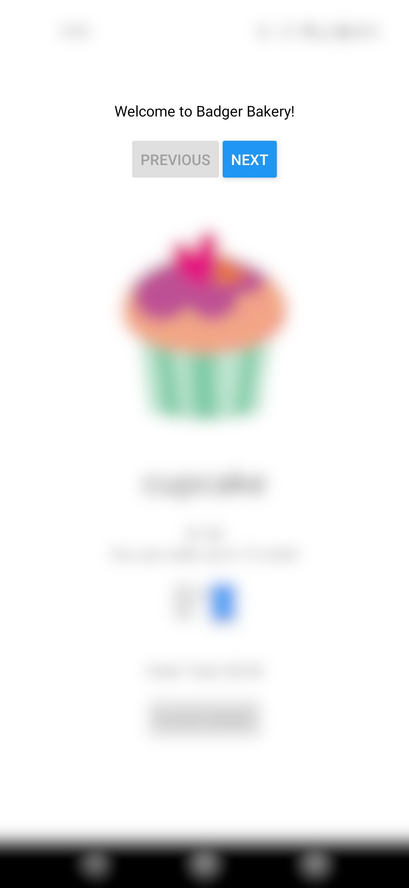
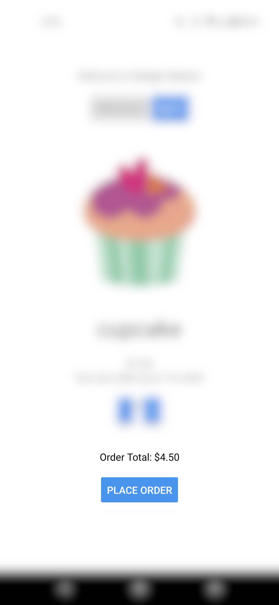
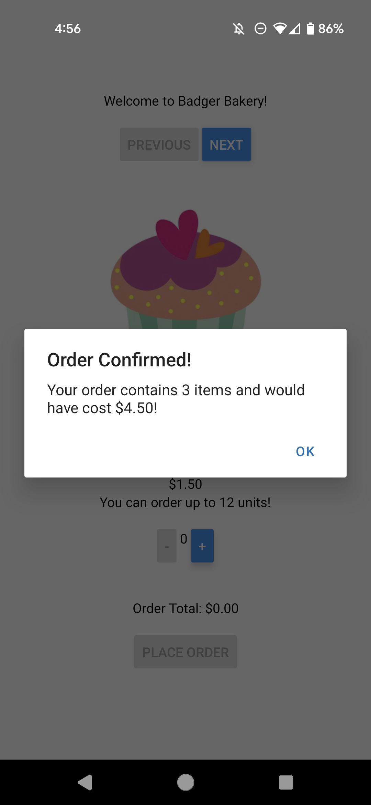

# CS571-F23 HW7: Badger Bakery (React Native!)

Welcome to Badger Bakery, Mobile! For this assignment, you will both prototype and implement a mobile app for Badger Bakery.

**Make sure to complete both parts of this assignment.**

## Badger Bakery Prototype

Create a [Figma prototype](http://figma.com/) for Badger Bakery. This prototype should be based on the requirements of *Badger Bakery Mobile* (not Badger Bakery Web!) which are...

1. Allow the customer to view some baked goods (e.g. muffins, pies, donuts, etc.)
2. Allow the customer to add baked goods to their basket.
2. Allow the customer to check out.

Your prototype should be built for a mobile device, though you can choose what particular model of phone it is for. Your prototype should also be low fidelity -- focus on the structural layout and don't get too caught up in your choice of fonts and pixel perfection. Furthermore, you don't need to prototype every "route" of the prototype -- it is perfectly fine to only show muffins being added to the basket but not donuts or pies. Furthermore, choosing quantities can be "hardcoded" -- e.g. three donuts can be added at once rather than clicking the add button three times. Prototyping input elements is difficult, so it is okay to "hardcode" their results.

However, your prototype **must** be *interactive*, e.g. the user should be able to navigate by pressing on the screen, **not** by pressing arrows on the keyboard.

**You will not be forced to implement your prototype in code,** so get creative! The implementation you do is shown in the screenshots and demo video below, but your prototype can look different!

When you are done, paste your *view-only* Figma link below. Make sure that it is **public**. *You can test this by opening the link in an incognito window.* **Not making the Figma link public could lose you points.** [Here is an example Figma prototype.](https://www.figma.com/file/dD7xbQEJWanguhnfwNFf40/BadgerChat-Mobile?node-id=0%3A1&t=7VTTaZERjsAKAgxs-1)

[Here is my Figma prototype.](https://www.figma.com/file/WFeULi1HM13aNm2B8vIMXn/Badger-Bakery-Mobile?type=design&node-id=0-1&mode=design&t=UsVUuRS3yKnsGRQx-0)


## Badger Bakery Implementation

The starter code provided to you was generated using [expo](https://expo.dev/), therefore the "boilerplate" code has already been generated. **You should *not* re-run the expo init command**. Instead, in this directory, simply run...

```bash
npm install
npm start
```

To test your app, you have a few options. If you have a smart device, I would recommend using the expo app for [iOS](https://apps.apple.com/us/app/expo-go/id982107779) or [Android](https://play.google.com/store/apps/details?id=host.exp.exponent&hl=en_US&gl=US). You can scan the QR code using your phone, or you can launch commands via the terminal. Otherwise, you can use an emulator (such as [AVD](https://developer.android.com/studio/run/emulator)). Do not use the web browser to test your code; you must test on Android or iOS!

Note that we are writing code in JavaScript for React Native; if you begin writing code in Objective-C, Swift, Java, or Kotlin you are likely doing something *very* wrong!

If you wish to avoid hardcoding your Badger ID, you may set an environment variable `EXPO_PUBLIC_CS571_BADGER_ID` with your `bid_...`. This may require a restart! Then, to get your Badger ID, you may...

```js
import CS571 from '@cs571/mobile-client'
// ...
CS571.getBadgerId(); // returns BID
```

### Important Notes
In this assignment, you may **not** hardcode the data of any items, such as their name. e.g. hardcoding "cupcake", "donut", "pie", or "cake" is prohibited!

### 1. Display Baked Goods

Fetch the baked goods from `https://cs571.org/api/f23/hw7/goods` and display them to the screen, including their name, image, price, and how many can be ordered. An `upperLimit` of `-1` means that unlimited of that baked good can be ordered.

Note that this endpoint returns an *object* and not a *list* -- you may find `Object.keys` helpful here.

Note that there are two different types of "cupcake", you should use its `id` as its `key`.

Do **NOT** use a `ScrollView`. We will paginate the baked goods by creating "previous" and "next" buttons in Step 2.



### 2. Navigate Between Baked Goods

Instead of showing all baked goods on the same screen, add "Previous" and "Next" buttons to allow the user to navigate between baked goods. The "previous" button should be disabled when viewing the first baked good, and the "next" button should be disabled when viewing the last baked good.



### 3. Add and Remove from Basket

Allow the user to add and remove items from their basket via "+" and "-" buttons. The "-" button should be disabled when the user has 0 of that item in their basket, and the "+" button should be disabled when the user has reached the `upperLimit` of that item. An `upperLimit` of `-1` means that unlimited of that baked good can be ordered.

I'd recommend creating a state variable in `BadgerBakery.jsx` that tracks the number of each item ordered and passing this down through props or a context to `BadgerBakedGood.jsx`


### 4. Show Order Total

The total cost of the items in the users' basket should be shown at the bottom of the screen displayed in dollars to the nearest hundredth.



### 5. Submit Order

The user should be able to "submit" their order by pressing a "place order" button. **This button should be disabled if there are no items in their basket.**

Upon submitting an order, a message should be displayed that says "Order Confirmed! Your order contains NUM_ITEMS items and costs $PRICE!" Be sure to display both the number of items sold and the total price. After, clear their basket and return to the first item.

**Note:** We aren't really "submitting" anything to the API, this should simply trigger an `Alert`.



### Other Notes
 - You may **NOT** assume that each bakery item's `name` is unique -- only its `id`. 
 - You may assume that each item contains a `name`, `price`, `img`, and `upperLimit`. You should use `toFixed(2)` to format the price/total of any monetary amounts.
 - You may **NOT** hardcode the data of any items, such as their name. e.g. hardcoding "cupcake", "donut", "pie", or "cake" is prohibited! Being a busy bakery in Madison, the items we sell may vary from day-to-day, and we should *not* assume we will always be selling these same items.

### Submission Details
In addition to your code, **you will also need to submit a video recording of your app**. Like the demo video, it should cover all the tasks below. Please thoroughly demonstrate all tasks to showcase the capabilities of your app.

**Please embed your recording as a Kaltura video.**

#### Tasks 
 - Navigate between **all** baked good items.
 - Add some items to your basket to enable the "place order" button.
 - Remove all items from your basket to disable the "place order" button.
 - Submit an order with some baked goods.
 - Submit an order with the maximum number of atleast one baked good.
